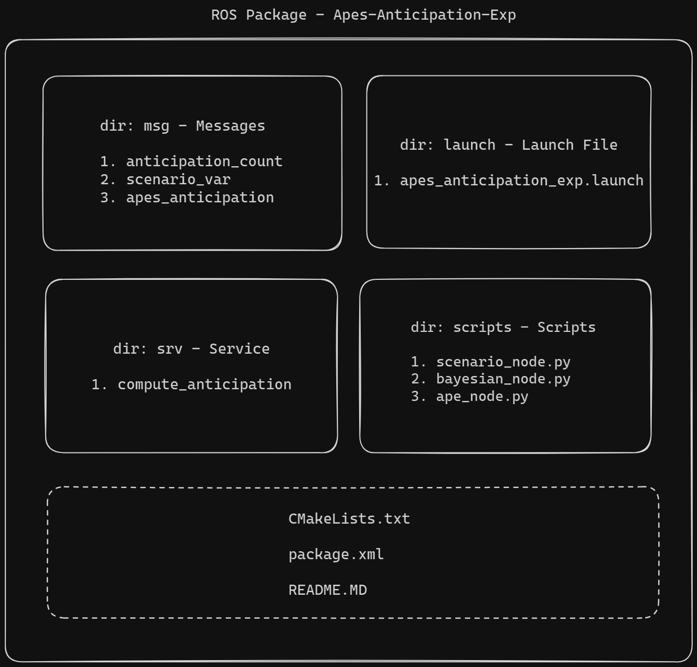
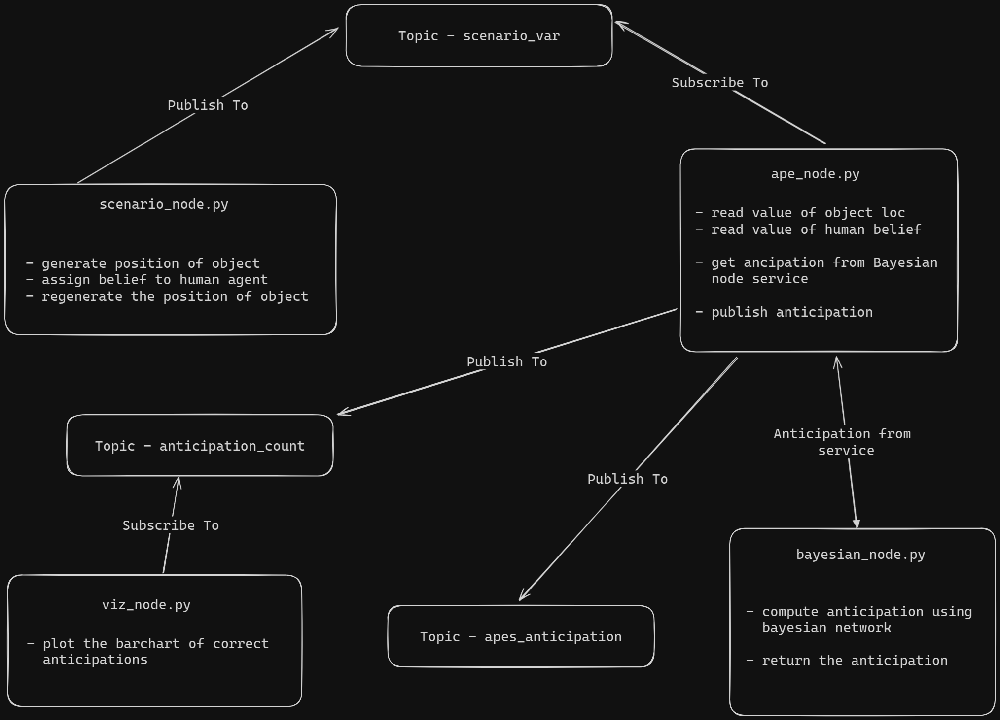

# Apes Anticipation Experiment

- Code developed by Kaviraj Gosaye QMUL

- Student ID: 220575371

- Package Name: apes_anticipation_exp

## Description:
This ROS package simulate an anticipatory looking experiment used to test if great apes can anticipate the false beliefs of humans.

A bayesian network is used to model the experiment.

The paper of the study can be found [here](https://www.science.org/doi/10.1126/science.aaf8110).

## Video Presentation: [Link](https://youtu.be/M0jVmHMZcz0)

## Commands to run package:

1. Unzip package apes_anticipation_exp into the 'src' folder of the root directory of your catkin workspace.

2. Launch a terminal for ROS

3. Execute the following to setup environment variables: source /opt/ros/noetic/setup.bash

4. Build package (in root directory): catkin_make

5. Source the workspace: source devel/setup.bash

6. Execute the command to run the package: roslaunch apes_anticipation_exp apes_anticipation_exp.launch

>Running the step 6 will start the nodes and service and rqt_graph and rqt_plot GUI will automatically open.

- Select the topics ape_anticipation/loc_ant, scenario_variables/belief and scenario_variables/loc in rqt_plot to visualize the values. 
- Select Nodes/Topics(active) and click on refresh in rqt_graph to visualize the nodes and topics

## Tech and Versions:
1. Ubuntu 20.04.6 - focal
2. ROS Noetic
3. catkin
4. rqt
5. Python 3.8.10
6. pgmpy

## Package Structure:

## Communication Flow:

